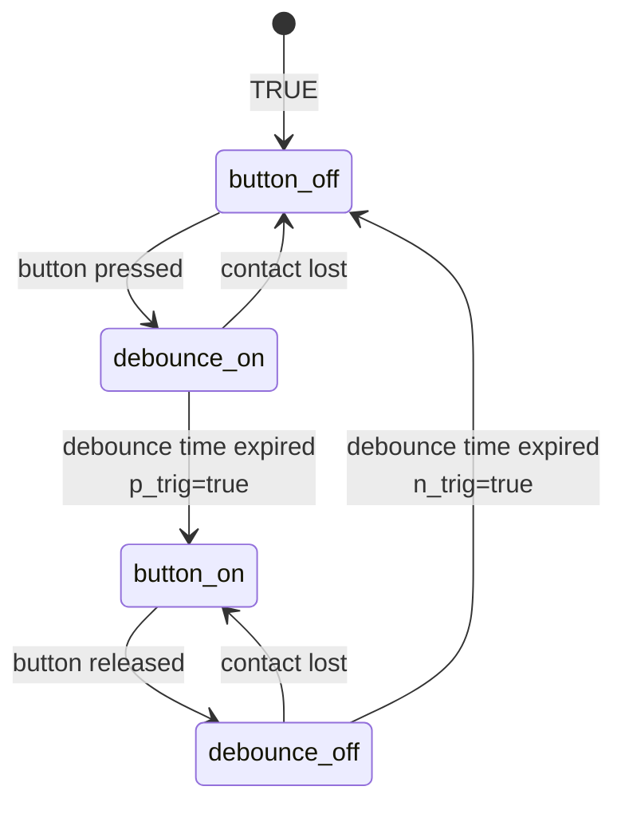

# Timed AC Power Source

This is an industry-like device that controls power delivery to a workbench. The necessity for this kind of device is motivated by safety aspects when working with hot devices (soldering irons, soldering stations, hot plates, glue guns etc.).

## How is it made...

The AC power monitor consists of some circuits:

1. Main AC circuit that transfers power to the sockets downstream. Protected by a B16 Differential Automatic switch and interrupted by a power contactor.
2. AC control circuit for the power contactor mentioned before. This one is triggered by a smaller relay.
3. Control circuit including LOLIN32 ESP platform, PIR sensor, interfacing push button with LED and the small 5V DC command relay.

## How it works

The intended use is described next:

1. When the device is plugged in and the automatic differential protection is armed, the 5V DC source will power the controller device and its dependencies. 
2. The power contacts are opened and no voltage is present on the output sockets.
3. When the button is pressed, the command relay closes the AC command circuit that energizes power contactor's coil. Thus, the power contacts will be closed and the output sockets will provide necessary AC power.
    - A time counter counts for 15 minutes and interrupts the main circuit when time is up.
    - This counter is reset each time the PIR sensor detects some movement in its field of view. In this manner, as long as there is somebody or something moving in front of the sensor, the workbench is powered continuously.
    - Also, the time counter is reset by each subsequent push on the control button (shorter than 1 sec).
4. The output power can be turned off by the user pushing the control button for more than 1 second.


## Schematic

## Code 

Developing the firmware part was far from being a challenge. There is nothing more than a suite of digital reads and writes and a single channel used as PWM output (analog).

As every time, I started by defining some constants that I later used within the code.

```c++
#define RLY_1 19      //Active LOW
#define RLY_2 23      //Active LOW
#define BTN_LED 21    //Active HIGH
#define BTN 22        //Active LOW
#define BLUE_LED 5    //Active LOW
#define PIR_SENSOR 17 //Active HIGH

#define TIME_BASE_MS 10 //used for time interrupt
#define RELAY_TIMEOUT 15*60000 //15 min
```

Because I wanted to overcomplicate it just for spiciness, I made a `button` class that implements a Finite State Machine, called `task()` to determine its possible states better. So, in this implementation, the signal coming from the button is debounced before switching states, the `on time` is measured and reported, and the positive and negative edges (switching from OFF to ON state and from ON to OFF state) are reported and can be used one time after.

`button` class definition is listed below:

```c++
class button{
  private:
  uint8_t pin;
  uint8_t state;
  uint16_t time_count;
  uint16_t time_base;
  bool active_high;

  public:
  bool isOn, isOff, p_trig, n_trig;
  uint16_t onTime;

  button (uint8_t pin, uint16_t time_base, bool active_high=true){
    this->pin=pin;
    this->time_base=time_base;
    this->active_high=active_high;
  }
  void updateTimeCount(){
    int32_t time_dif = (int32_t)this->time_count - this->time_base; 
    if (time_dif<0){
      this->time_count=0;
    }else{
      this->time_count=time_dif;
    }

    if(this->isOn){
      this->onTime+=this->time_base;
    }
  }
  void task(){
    bool pin_state=digitalRead(this->pin);
    switch(this->state){
      case 0:{ //state off
        this->isOff=true;
        this->isOn = false;
        this->p_trig=false;
        this->n_trig=false;
        if ((this->active_high && pin_state)||(!this->active_high && !pin_state)){
          //input transition to on state
          this->time_count=100;
          this->state=1;
        }
        break;
      }
      case 1:{ //wait time to expire
        if (!((this->active_high && pin_state)||(!this->active_high && !pin_state))){
          //on state lost
          this->state=0;
          break;
        }
        if (this->time_count==0){
          this->p_trig=true;
          this->onTime=0; //reset "time on" counter
          this->state=2;
        }
        break;
      }
      case 2:{ //state on
        this->isOff=false;
        this->isOn = true;
        this->p_trig=false;
        this->n_trig=false;
        if (!((this->active_high && pin_state)||(!this->active_high && !pin_state))){
          //input transition to off state
          this->time_count=100;
          this->state=3;
          break;
        }
        break;
      }
      case 3:{ //wait time to expire
        if ((this->active_high && pin_state)||(!this->active_high && !pin_state)){
          //off state lost
          this->state=2;
          break;
        }
        if (this->time_count==0){
          this->n_trig=true;
          this->state=0;
        }
        break;
      }
      default:{
        break;
      }
    }
  }
};
```

Functionality of the button monitoring code is depicted in the diagram below:



After class definition comes `Global Variables`

```c++
/********GLOBAL VARIABLES************/
Ticker myTimer;
uint8_t timer_new_tick=false;
button start_btn = button(BTN, TIME_BASE_MS, true);
uint8_t relayState=0;
uint32_t relayTimeCounter=0;

static uint16_t pwm_width=0;
static bool pwm_count_up=true;
```

Of course, having timed events, it is necessary to have some sort of time triggered routine. Here I make sure that time counters from `button` object are updated and also i decrease a time counter associated with the output relay as long as it is not already 0 (zero). 

```c++
void onTimer(){
  timer_new_tick+=1;
  start_btn.updateTimeCount();
  if (relayTimeCounter<TIME_BASE_MS){
    relayTimeCounter=0;
  }else{
    relayTimeCounter-=TIME_BASE_MS;
  }
}
```

Initialization section defines the pins directions and sets their initial states. Also the timer interrupt is set there.

```c++
void setup() {
  pinMode(RLY_1, OUTPUT);
  digitalWrite(RLY_1, HIGH);
  pinMode(RLY_2, OUTPUT);
  digitalWrite(RLY_2, HIGH);
  pinMode(BTN_LED, OUTPUT);
  digitalWrite(BTN_LED, LOW);
  pinMode(BLUE_LED, OUTPUT);
  digitalWrite(BLUE_LED, HIGH);
  pinMode(BTN, INPUT);
  pinMode(PIR_SENSOR, INPUT);

  myTimer.attach(TIME_BASE_MS/1000.0, &onTimer);
  relayTimeCounter=1000; //1sec
}
```

### Main **loop** function

In the main loop I implemented:

1. Relay state control. 

    ```c++
    switch(relayState){
        case 0: {//device started
        digitalWrite(RLY_1, HIGH);
        if (relayTimeCounter==0){
            relayState=1;
        }
        }
        case 1: {//relay off
        digitalWrite(RLY_1, HIGH);
        if(start_btn.isOff){
            relayState=2;
        }
        break;
        }
        case 2: {//relay off - can be turned on
        if(start_btn.isOn){
            relayState=3;
        }
        break;
        }
        case 3: {//relay on
        digitalWrite(RLY_1, LOW);
        if(start_btn.isOff){
            relayState=4;
        }
        break;
        }
        case 4: {//relay on - can be turned off
        if(start_btn.isOn && start_btn.onTime>=1000){
            relayState=1;
        }
        if (relayTimeCounter==0){
            relayState=1;
        }
        break;
        }
    }
    ```
1. LED control - that depends on relay control state and evolves after each timer interrupt only.

    ```c++
    if(timer_new_tick>=2){
        switch (relayState){
            case 0:{
                analogWrite(BTN_LED, 0);
                break;
            }
            case 1:{
                pwm_up_down(0, 50);
                analogWrite(BTN_LED, pwm_width);
                break;
            }
            case 2:{
                pwm_up_down(0, 50);
                analogWrite(BTN_LED, pwm_width);
                break;
            }
            case 3:{
                pwm_up_down(50, 150);
                analogWrite(BTN_LED, pwm_width);
                break;
            }
            case 4:{
                pwm_up_down(50,150);
                if(digitalRead(PIR_SENSOR)){
                analogWrite(BTN_LED, 255);
                }else{
                analogWrite(BTN_LED, pwm_width);
                }
                
                break;
            }
        }
        timer_new_tick=0;
    }
    ```
1. Rearming the relay timer each time the PIR sensor detects some movement or the start button is pressed again for less than 1 sec.
    ```c++
    //rearm the relay time counter
    if(start_btn.isOn){
        if(relayState>0){//device initialization done
        relayTimeCounter=RELAY_TIMEOUT;
        }
    }  

    if(digitalRead(PIR_SENSOR)){
        digitalWrite(BLUE_LED, LOW);
        if(relayState>0){//device initialization done
        relayTimeCounter=RELAY_TIMEOUT;
        }
    }else{
        digitalWrite(BLUE_LED, HIGH);
    }
    ```

>**NOTE!**
>
>The blue LED mentioned in code is a LED that exists on the LOLIN32 board by default, and I used it as indicator for when the PIR sensor detects something.